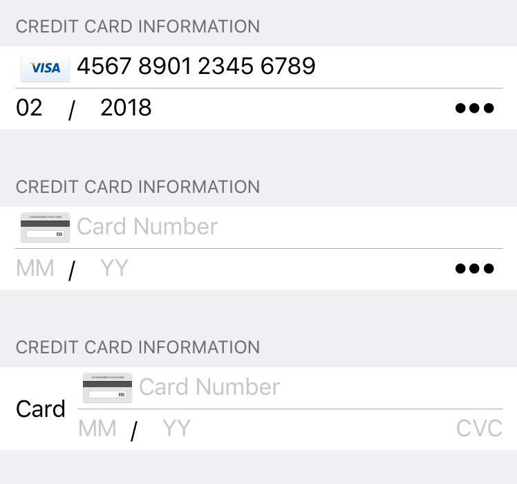

# EurekaCreditCard
Eureka custom row and cell for credit card data

## Install

1. Copy the swift files manually

2. Add dependencies:
```
pod 'Eureka'
pod 'BKMoneyKit', :git => 'https://github.com/bkook/BKMoneyKit'
```

## Example
```swift
form +++= Section("Credit card information")

                <<< CreditCardRow() {
            //$0.title = "Card"
            $0.cardNumberPlaceholder = "Card Number"
            $0.expirationMonthPlaceholder = "MM"
            $0.expirationYearPlaceholder = "YY"
            $0.cvcPlaceholder = "CVC"
            //$0.dataSectionWidthPercentage = CGFloat(0.5)
//            $0.value = CreditCard()
            $0.value = CreditCard(
            cardNumber: "1",
                    expirationMonth: "02",
                    expirationYear: "2018",
                    cvc: "4"
            )
        }
```

## Screenshots

##### Styles


##### Selectors for month and year


### TODO
* demo project
* pod specs
* SwiftValidator integration?

